### 1. Настройка **gitlab-runner**

1. Поднимем виртуальную машину *Ubuntu Server 22.04 LTS*.
   - Скачаем с официального сайта образ: https://ubuntu.com/download/server

   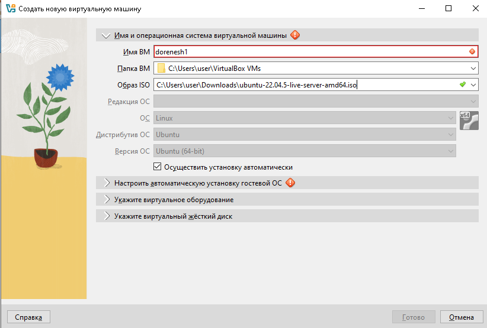

   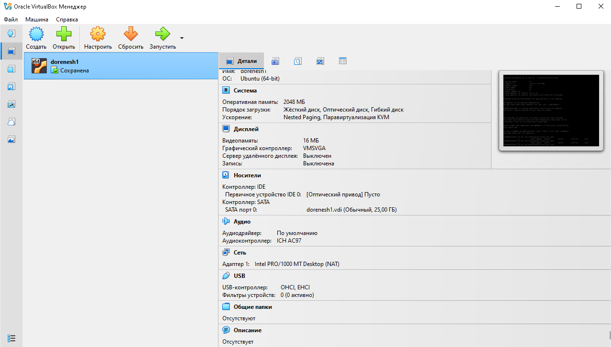

2. Скачаем и установим на виртуальную машину **gitlab-runner**.

```
curl -LJO "https://gitlab-runner-downloads.s3.amazonaws.com/latest/deb/gitlab-runner_amd64.deb"

dpkg -i gitlab-runner_amd64.deb
```

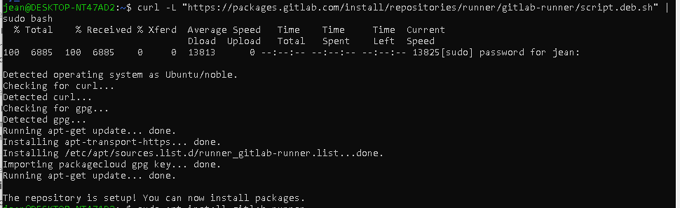

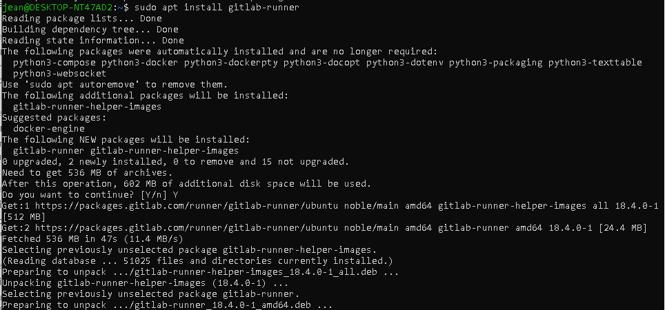

3. Запустим **gitlab-runner** и зарегистрируем его для использования в текущем проекте (*DO6_CICD*).

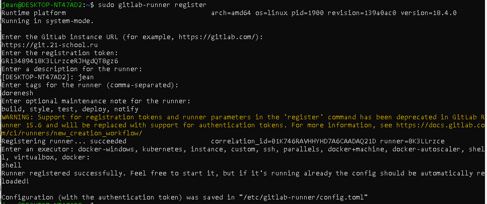

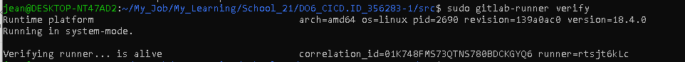

### 2. Сборка

1. Напишем этап для **CI** по сборке приложений из проекта *SimpleBashUtils*.

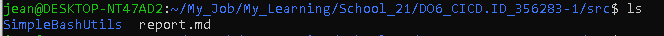

2. В файле *.gitlab-ci.yml* добавь этап запуска сборки через мейк файл из проекта *SimpleBashUtils*.

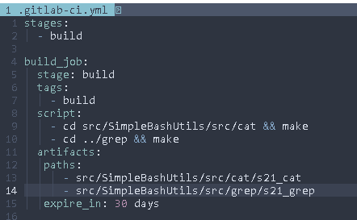

Для проверки необходимо включить и запустить ранер.

```
sudo gitlab-runner start
sudo gitlab-runner run
```

3. На странице проекта в GitLab нужно зайти в раздел Pipelines и посмотреть состояние конвейера:

   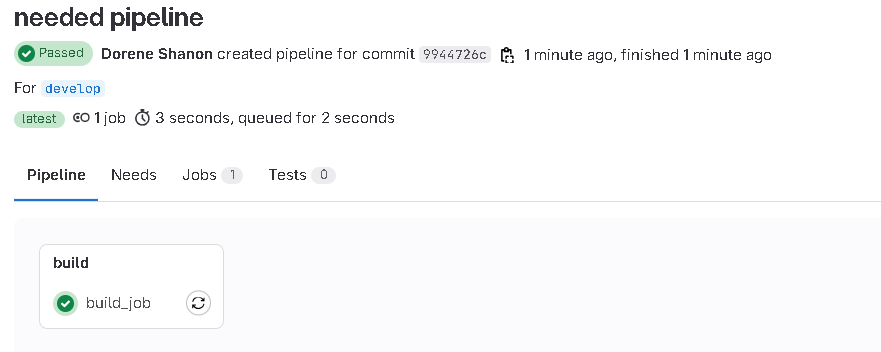

   

   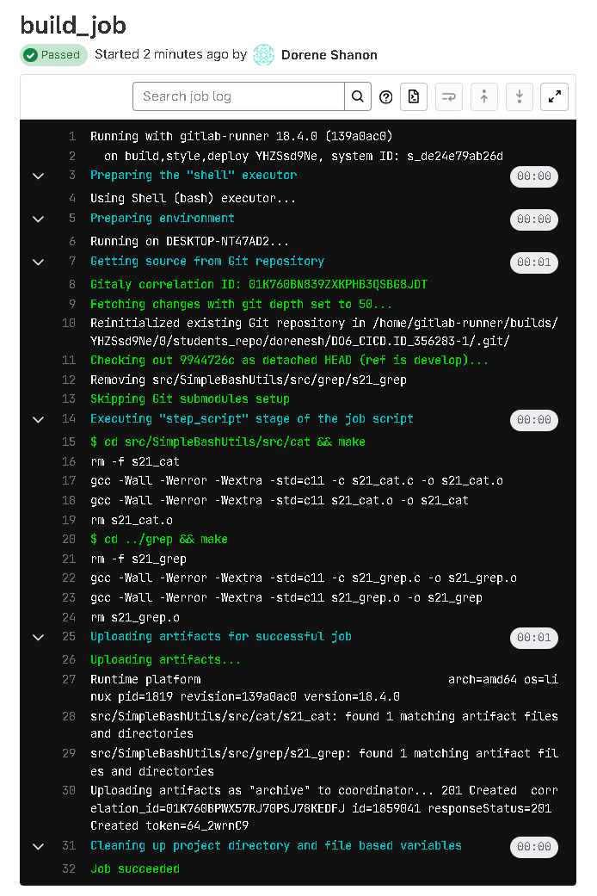

### 3. Тест кодстайла

1. Напишем этап для **CI**, который запускает скрипт кодстайла (*clang-format*).

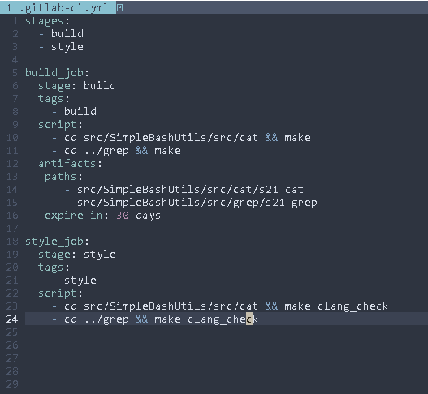

2. Запушим изменение в ветку и Pipeline автоматически запустится:

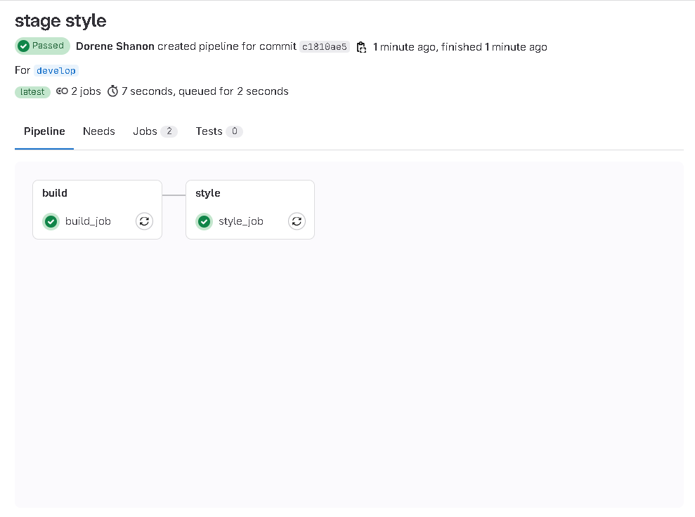

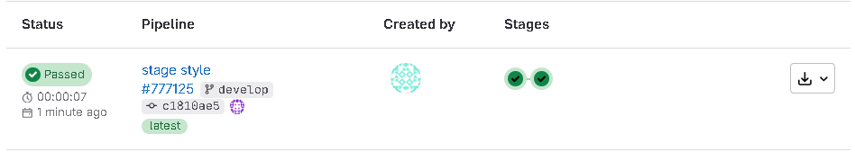

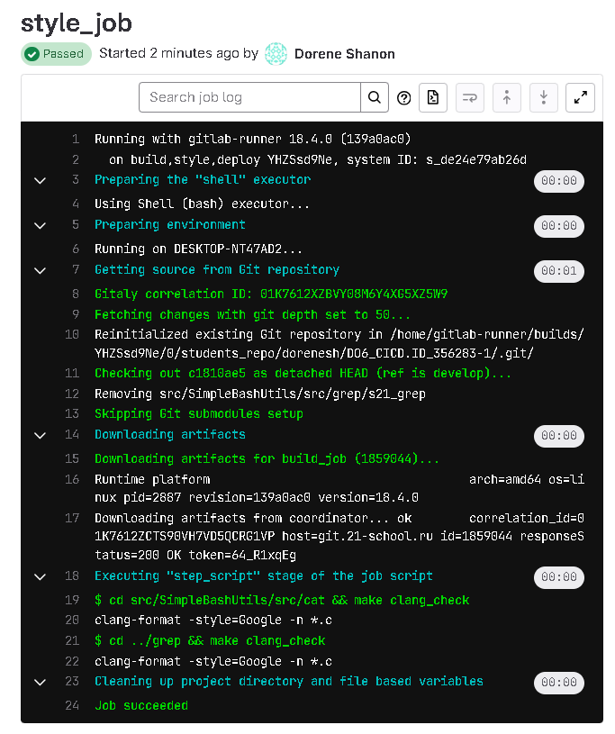

### 4. Интеграционные тесты

1. Напишем этап для **CI**, который запустит интеграционные тесты. 
   - Запустить этот этап автоматически только при условии, если сборка и тест кодстайла прошли успешно. Если тесты не прошли, то «зафейлить» пайплайн. 
   - В пайплайне отобразить вывод, что интеграционные тесты успешно прошли / провалились.

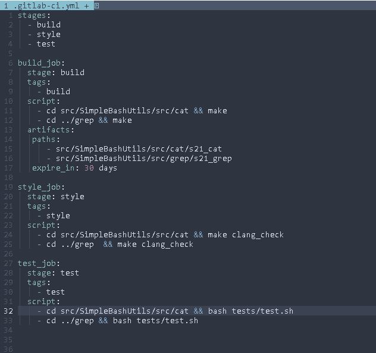

2. Запушим изменение в ветку и Pipeline автоматически запустится:

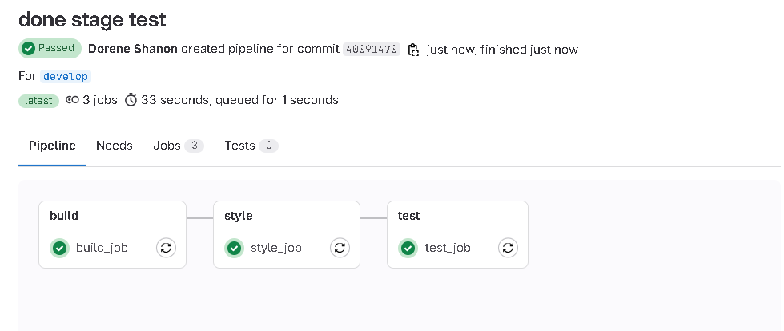

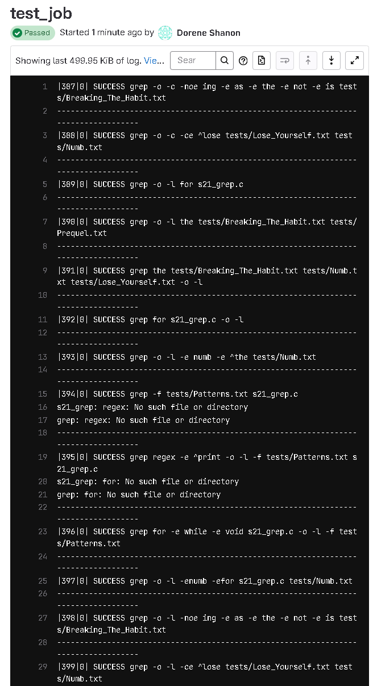

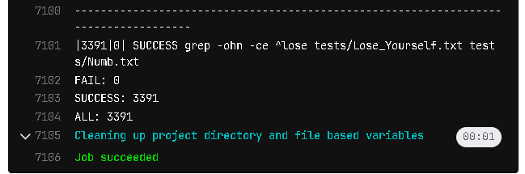

### 5. Этап деплоя

1. Поднимем вторую виртуальную машину *Ubuntu Server 22.04 LTS*.
   - Склонируем виртуальную машину dorenesh1:

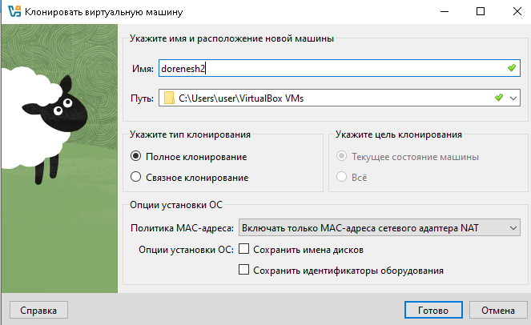

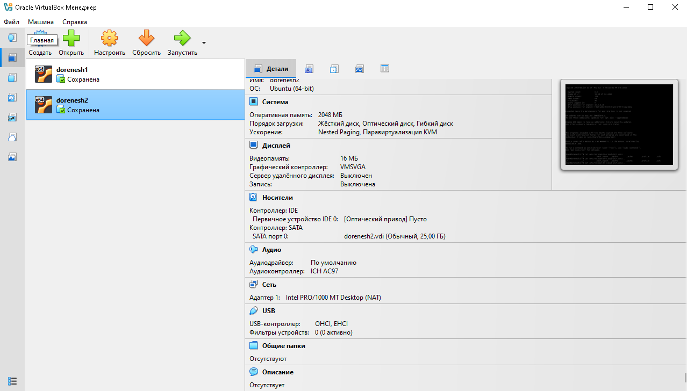

2. Настроим роуты на машинах

```
vim /etc/netplan/00-installer-config.yaml
```

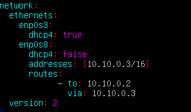

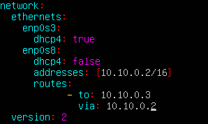

```
sudo netplan apply
```

3. Напиши bash-скрипт, который при помощи **ssh** и **scp** копирует файлы, полученные после сборки (артефакты), в директорию */usr/local/bin* второй виртуальной машины.

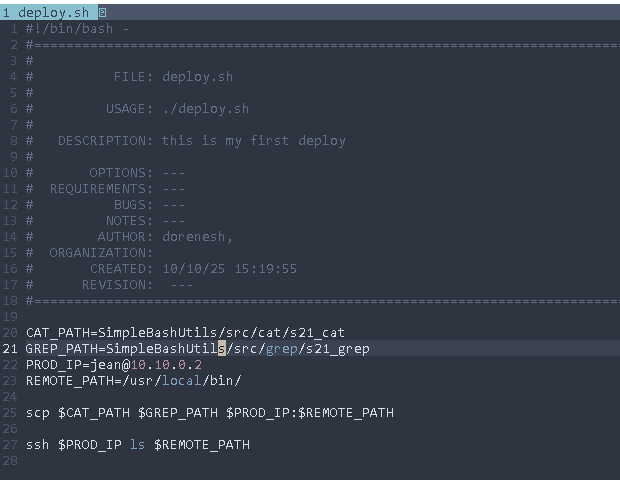

4. В файле *.gitlab-ci.yml* добавь этап запуска написанного скрипта.

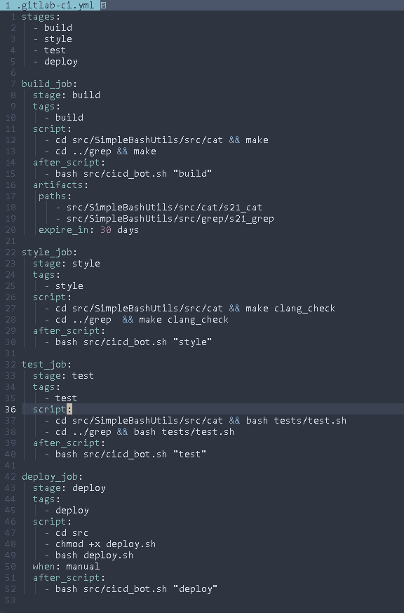

### 6. Дополнительно. Уведомления

Настроим уведомления об успешном/неуспешном выполнении пайплайна через бота с именем «dorenesh CI/CD» в *Telegram*.

1. Чтобы создать бота, напишем @botfather в Telegram:

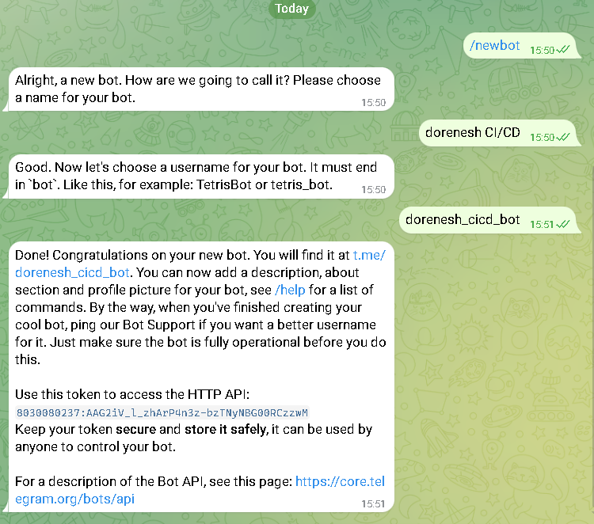

2. Напишем bash скрипт для отправки сообщений в Telegram:

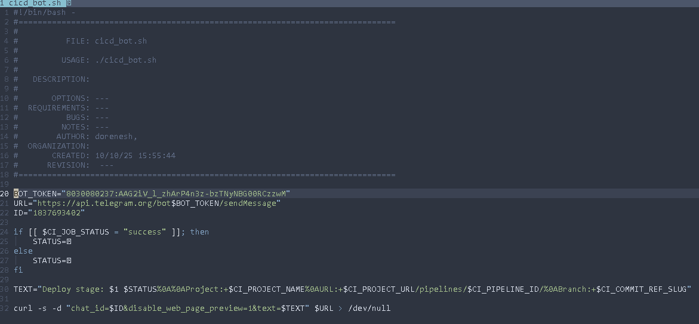

3. Расширим *.gitlab-ci.yml* ,чтобы после каждой стадии нам приходило сообщение со статусом:


4. Проверяем, что получилось:

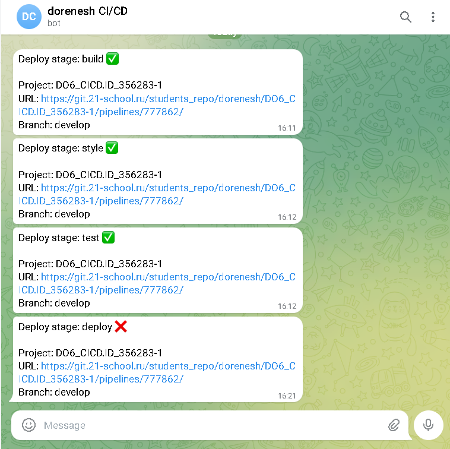
