## **1. Готовый докер**

1. Возьмем официальный образ Docker от nginx:

        sudo docker pull nginx

    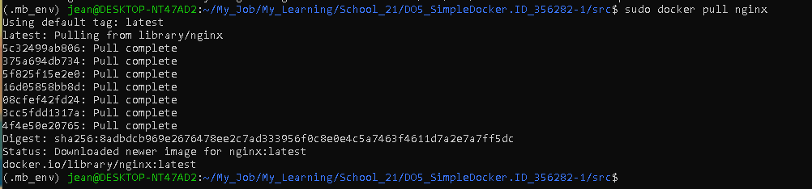

2. Проверим наличие образа:

        sudo docker images

    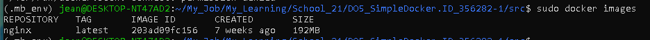

3. Запустим образ Docker:

        sudo docker run -d 203ad09fc156

    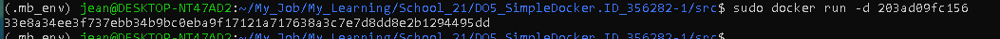

4. Проверим, что образ запущен:

        sudo docker ps 

    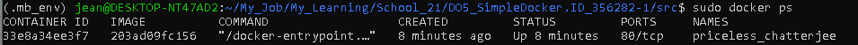

5. Просмотрим информацию о контейнерах:

        sudo docker inspect 33e8a34ee3f7

    
    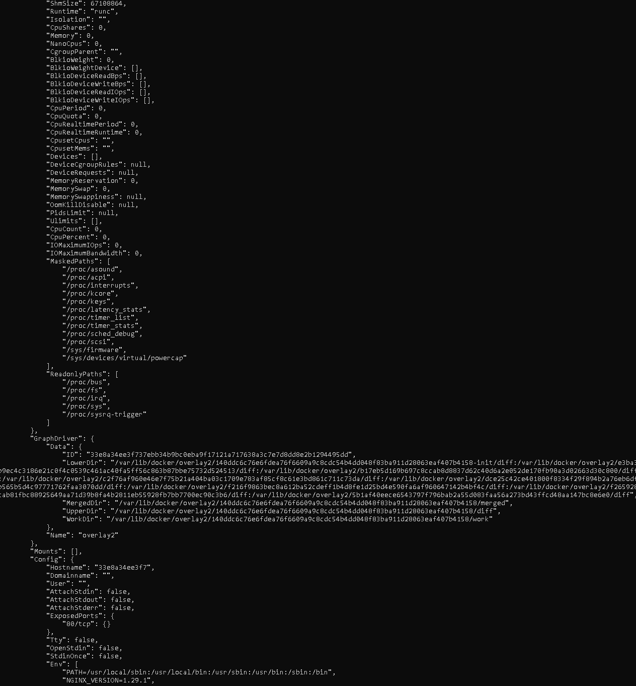
    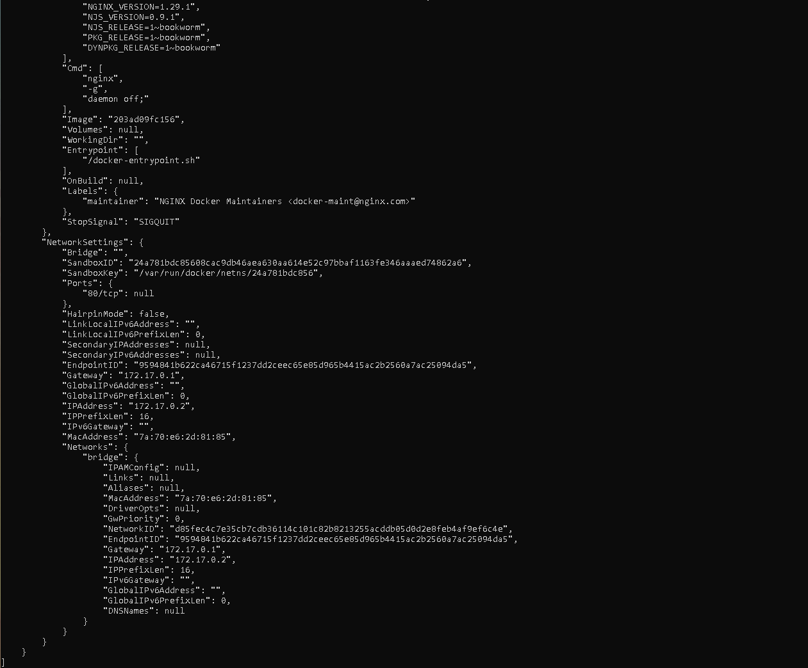

6. Из вывода команды определим и запишем в отчет размер контейнера, список сопоставленных портов и IP-адрес контейнер:
        **Размер контейнера:**   *67108864*
        **Список сопоставленных портов:**   *80/tcp*
        **IP-адрес контейнер:**   *172.17.0.2*

7. Остановим Docker-контейнер:

        sudo docker stop 33e8a34ee3f7

    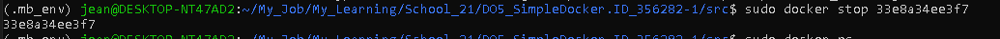

8. Проверим, остановился ли контейнер docker ps:

        sudo docker ps

    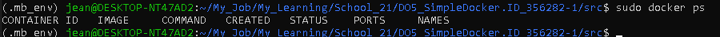

9. Запустим Docker с портами 80 и 443 в контейнере, сопоставленными с теми же портами на локальной машине, с помощью команды run:

        sudo docker run -d -p 80:80 -p 443:443 203ad09fc156

    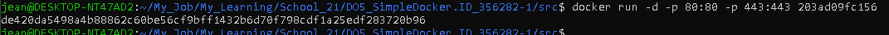

10. Проверим, доступна ли стартовая страница nginx в браузере по адресу localhost:80:

    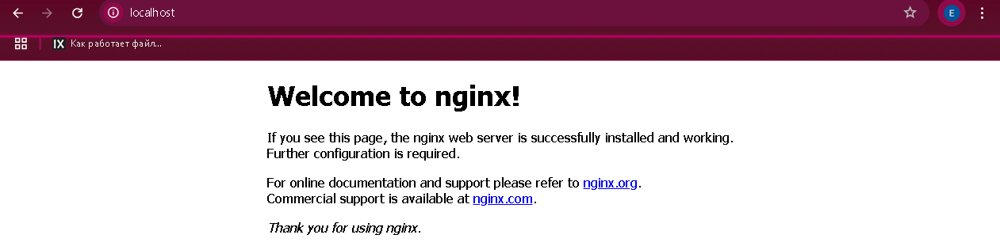

11. Перезапустим Docker-контейнер:

        sudo docker restart de420da5498a 

    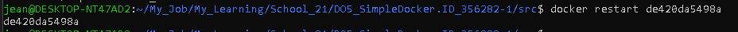

12. Проверим любым способом, что контейнер работает:

        sudo docker ps

    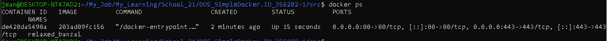
    
    

## **2. Операции с контейнером**

1. Прочитаем файл конфигурации nginx.conf внутри контейнера Docker с помощью команды exec:
   
         docker exec de420da5498a cat /etc/nginx/nginx.conf
    
    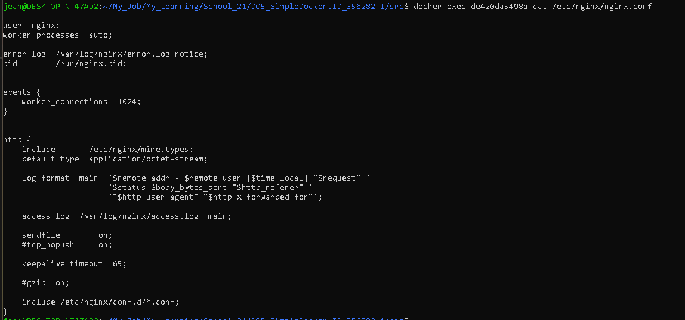
    
2. Создадим файл nginx.conf на локальной машине:

    

3. Настроим его в пути /status для возврата страницы состояния сервера nginx:

    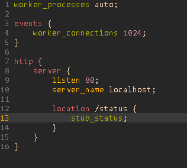

4. Скопируем созданный файл nginx.conf внутрь образа Docker с помощью docker cpкоманды.

        docker cp nginx.conf de420da5498a:/etc/nginx/nginx.conf

    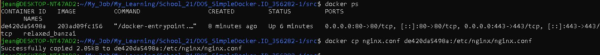

5. Перезапустим nginx внутри образа Docker с помощью exec:

        docker exec de420da5498a nginx -s reload

    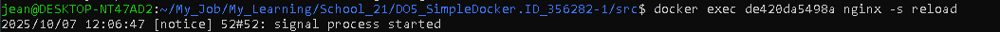

6. Убедимся, что localhost:80/status возвращает страницу состояния сервера nginx:
        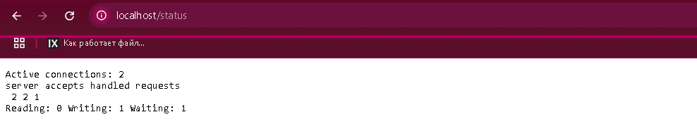
    
7. Экспортируем контейнер в файл container.tar с помощью команды export:

        docker export de420da5498a > container.tar

    

8. Остановим контейнер:

        docker stop de420da5498a

    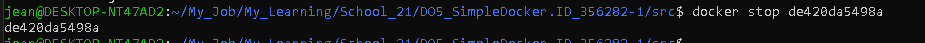

9. Удалим изображение, docker rmi [image_id|repository]не удаляя предварительно контейнер:

        docker rmi 203ad09fc156

    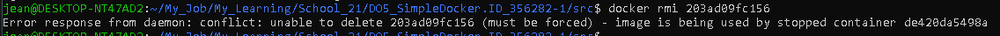

    ```
    docker rmi -f 203ad09fc156
    ```

    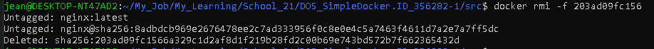

10. Удалим остановленный контейнер:

        docker rm de420da5498a

    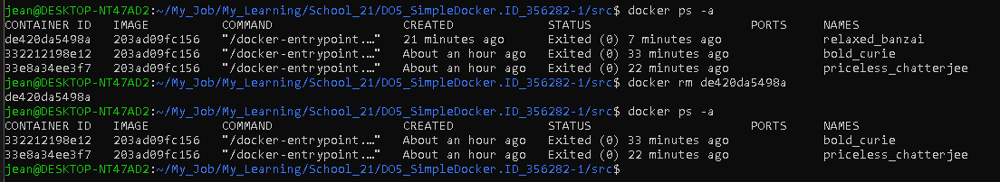

11. Импортируем контейнер обратно с помощью команды import:

        docker import -c 'cmd ["nginx", "-g", "daemon off;"]' -c 'ENTRYPOINT ["/docker-entrypoint.sh"]' ./container.tar s21_nginx

    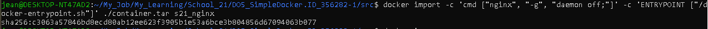

12. Запустим импортированный контейнер:

        docker run -d -p 80:80 -p 443:443 c3063a57846b

    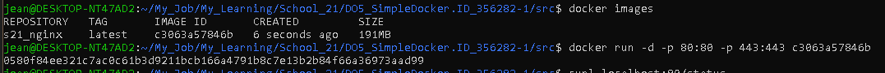

13. Убедимся, что localhost:80/status возвращает страницу состояния сервера nginx:

        curl localhost:80/status

    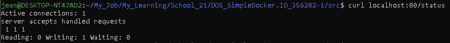

    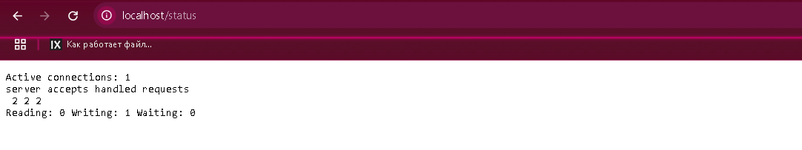

## **3. Мини веб-сервер**

1. Напишем мини-сервер на C и FastCgi:

    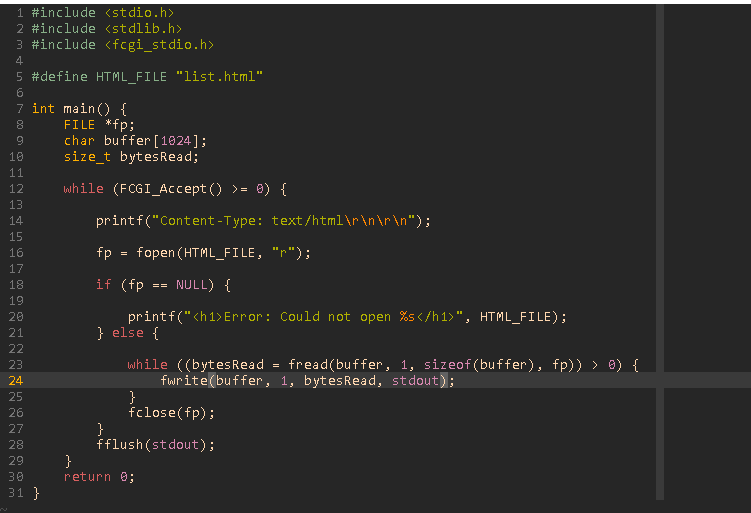

2. Запустим написанный мини-сервер через spawn-fcgi на порту 8080:

    gcc -o mini_server server.c -lfcgi

    spawn-fcgi -p 8080 ./mini_server

    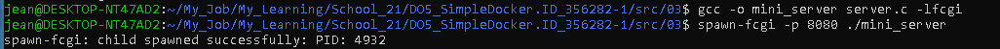

3. Напишем свой собственный nginx.conf , который будет перенаправлять все запросы с порта 81 на 127.0.0.1:8080:

    

4. Запустим nginx локально с написанной конфигурацией:

    sudo nginx -c /home/jean/My_Job/My_Learning/School_21/DO5_SimpleDocker.ID_356282-1/src/03/nginx.conf

    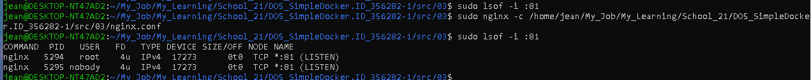

5. Проверим, что браузер на localhost:81 возвращает написанную вами страницу:

    

6. Поместим файл nginx.conf в папку ./nginx/nginx.conf (он понадобится вам позже):

    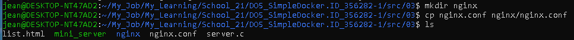
    
    

## **4. Мой собственный докер**

1. Напишем свой собственный образ Docker, который:

    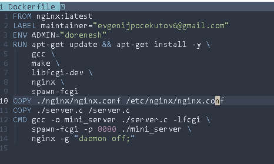

2. Создадим записанный образ Docker с помощью docker build:

    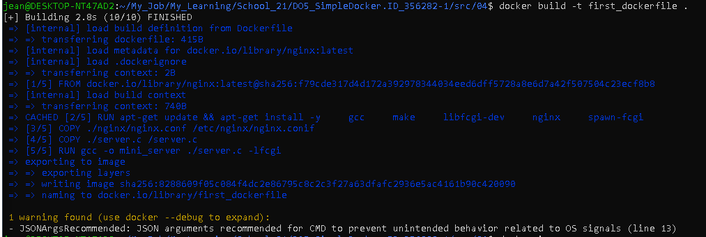

3. Проверим, docker images что все построено правильно:

    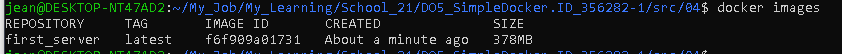

4. Запустим собранный образ Docker, сопоставив порт 81 с портом 80 на локальной машине и сопоставив папку ./nginx внутри контейнера с адресом, по которому находятся файлы конфигурации nginx (см. Часть 2 ):

    ```
    docker run -p 80:81 -v $PWD/nginx/nginx.conf:/etc/nginx/nginx.conf -d first_server
    ```

    

5. Проверим, что страница написанного мини-сервера доступна на localhost:80:

​	

6. Добавим проксирование страницы /status в ./nginx/nginx.conf для возврата статуса сервера nginx:

    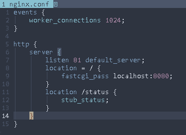

7. Проверим, что localhost:80/status теперь возвращает страницу со статусом nginx .

    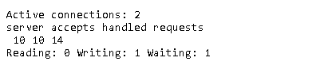

## 5. **Dockle**

1. Установим dockle

   ```
   curl -L -o dockle.deb https://github.com/goodwithtech/dockle/releases/download/v0.4.14/dockle_0.4.14_Linux-64bit.deb
   sudo dpkg -i dockle.deb && rm dockle.deb
   ```
    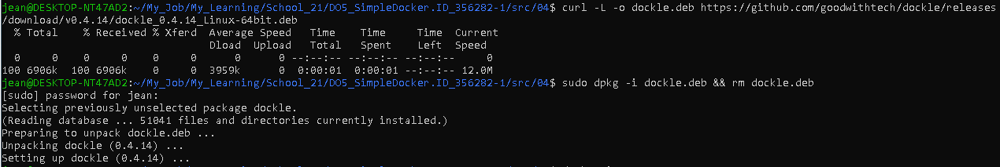
2. Проверим образ из предыдущего задания:

    ```
    dockle first_server
    ```

    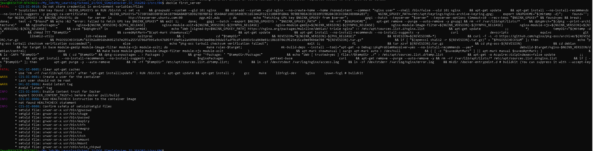

3. Исправим образ так, чтобы не было ошибок и предупреждений при проверке с помощью Dockle :

    Мы встретились с двумя ошибками:
    1. Dockle находит уязвимости в базовых слоях самого официального образа NGINX, поэтому все что мы можем это просто добавить игнорирование предупреждений, так как:
    - Официальный образ NGINX проверен и безопасен

    - Проблема в GPG ключах - это false positive для базовых образов

    - Мы не можете исправить базовые слои официального образа

    - Это стандартная практика при использовании официальных образов

    Но если все же решите ее исправить, как я, то просто не используйте nginx 

    2. Необходимо добавить очистку кэша в каждом RUN с apt

    До:
        

    После:
        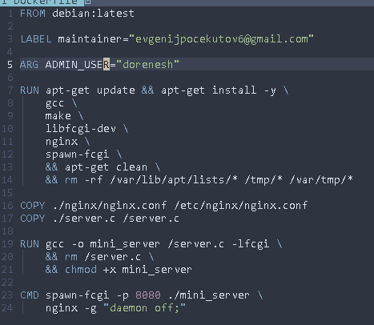

    Результат:
        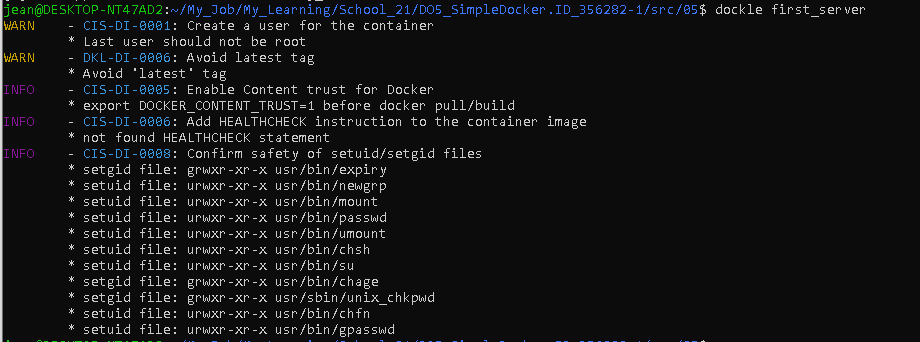

    

## 6. Базовый **Docker Compose**

1. Напишем файл *docker-compose.yml*:

2. Запустим Docker-контейнер из [Части 5 ](https://platform.21-school.ru/project/26565/task?studentId=d640606e-1e0a-47e4-839c-6ab5e8108dd2#part-5-dockle)*(он должен работать в локальной сети)* :
   
    ```
    docker run -v $PWD/nginx/nginx.conf:/etc/nginx/nginx.conf -d first_server
    ```

    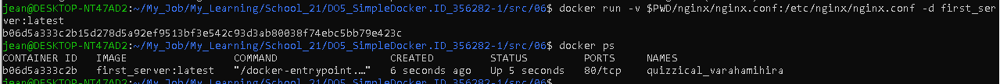

    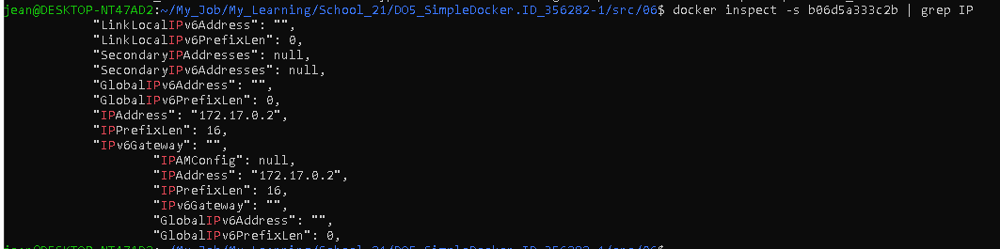

3. Запустим Docker-контейнер с **nginx** , который будет перенаправлять все запросы с порта 8080 на порт 81 первого контейнера:

    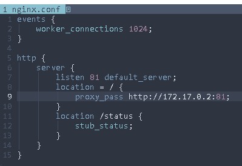

4. Подключим порт 8080 второго контейнера к порту 80 локальной машины:

    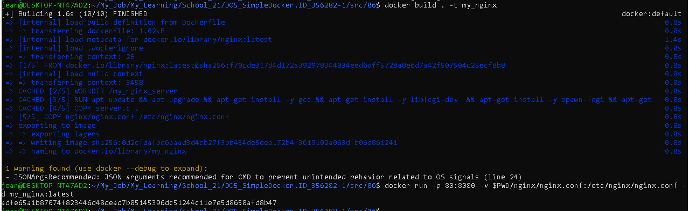

5. Остановим все работающие контейнеры:

    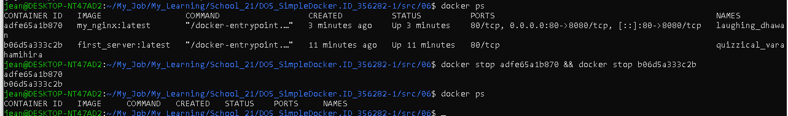

6. Соберем и запустим проект:

    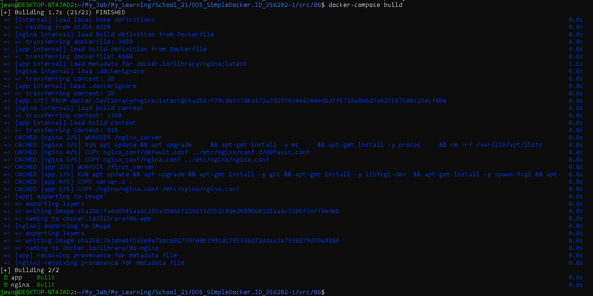

    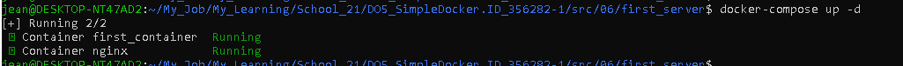

    -d используется для остановки логов, чтобы запуск прошел быстрее.

7. Проверим, что браузер возвращает страницу, которую мы написали на *localhost:80* :
   
    